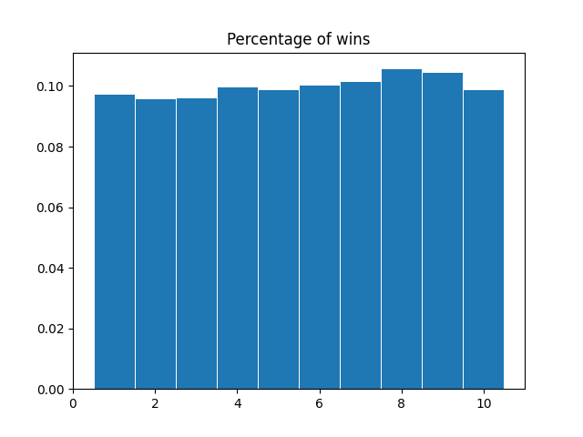

# LeftRightCenter
A quick analysis for the game Left Right Center. After testing a couple variations, the main consideration for any player attempting to get a slight advantage is to go in the latter half of players, preferably 2nd to last in larger groups, or last in smaller groups.

I don't think this graph gives a great insight into the results, but it's here for posterity.

This graph gives us far better insight, seeing the clear demarkation between those who are in the first half of players and those who are in the latter half.
